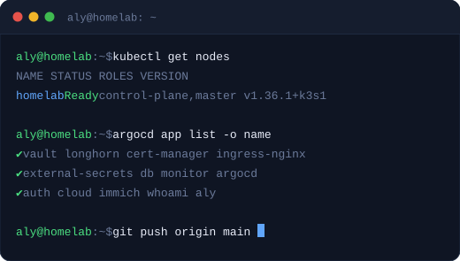

  

# hl-beta

A single-node k3s homelab cluster on Ubuntu, provisioned from scratch and managed entirely through GitOps. One `git push` reconciles the full stack — ArgoCD, Vault, cert-manager, ingress-nginx, monitoring, and a suite of self-hosted applications.

Provisioning scripts in `provision/` rebuild everything from bare metal. Helm values and application manifests live in `k8s/`. Full architecture notes, component references, and rebuild guides are at:

**→ [homelab.alybadawy.com](https://homelab.alybadawy.com)**
